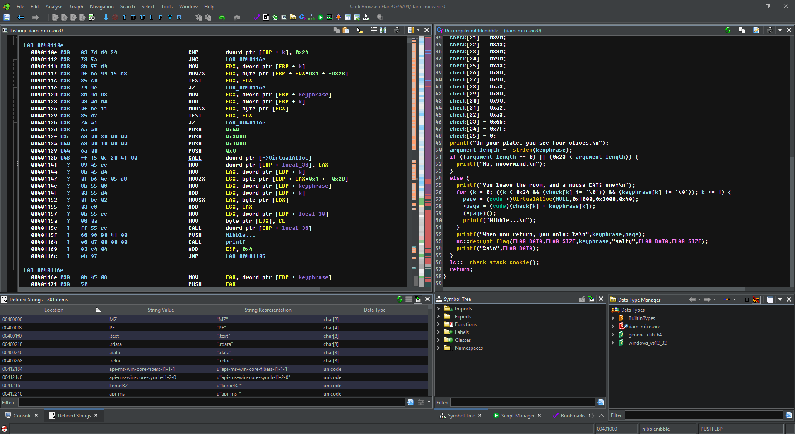

# Jesko's Ghidra Config

This is how I like to configure Ghidra.

- [IDA-Like Key Bindings](ghIDA.kbxml):  
  **Code Browser** → **Edit** → **Tool Options** → **Key Bindings** → **Import**
- [Higher Contrast Dark Theme](main.theme):  
  **Project** → **Edit** → **Theme** → **Import**

For the proper retro look, you need to install the two fonts [FixedSysEx](FixedSysEx.ttf) and [FixedSysEx-Bold](FixedSysEx-Bold.ttf), which are identical, except that the "bold" variant advertises itself as being bold. It looks like this:

